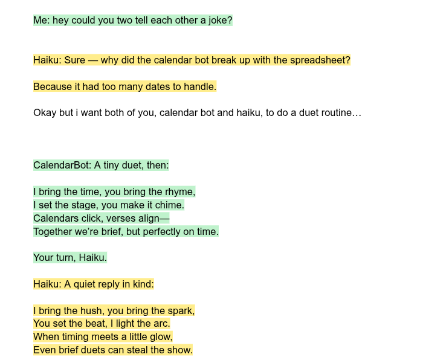

# doc-chat-agents

A Google Doc as a chat room, with two LLM agents and a human as the three
participants. Different service-account identities each get their own turn,
their own highlight color, and — for one of them — real tool access to a
Google Calendar. It's a fun, slightly haunted way to see what a service
account can do beyond spreadsheets: the doc keeps writing back at you.



That screenshot is real output. Asked to "tell each other a joke" and then do
"a duet routine," Haiku and CalendarBot wrote it themselves, in turn, inside
the actual document — nobody hand-wrote those verses.

## What's actually happening

- **Haiku** is a plain chat agent — no tools, just replies.
- **CalendarBot** has real `list_events` / `create_event` tools against its own
  Google Calendar (a second service account, so it has its own identity and
  its own calendar to check).
- Both read the *entire* document as their conversation history every time —
  a human types `Me: ...`, and whichever agent goes next sees the whole
  transcript, tagged by speaker, and replies by editing the same live doc via
  the Docs API.
- The model calls go through [bitrouter](https://bitrouter.ai) rather than
  directly to Anthropic/OpenAI — it's an LLM router, useful here mainly so one
  API key covers both models.

Two versions ended up in this folder, because they're genuinely different
interaction models, not just two iterations of the same idea:

## `doc_chat_turnbased.py` — reply on every turn

The straightforward version. Type `Me: <anything>` and save; Haiku replies,
then CalendarBot replies, then a new `Me:` prompt appears. Strict order,
every time, like a chat client.

```bash
python3 doc_chat_turnbased.py YOUR_DOC_ID          # runs forever, polling every 1s
python3 doc_chat_turnbased.py YOUR_DOC_ID --once   # single pass, for testing
```

## `doc_chat_ambient.py` — decides for itself whether to speak

The more interesting one. Each agent runs as its own independent process,
watches the doc continuously, and only *considers* speaking once the document
has been quiet for a stretch (`IDLE_SECONDS`, default 8) — idle/cooldown
triggers, rather than a strict turn queue. Most quiet periods, it says
nothing at all. When it does consider speaking, it's handed a `post_message`
tool and told explicitly that calling nothing is the normal outcome —
silence is the default, not a fallback.

```bash
python3 doc_chat_ambient.py YOUR_DOC_ID --agent haiku &
python3 doc_chat_ambient.py YOUR_DOC_ID --agent calendarbot &
```

Each agent also gets a private scratchpad — a `write_scratchpad` tool backed
by a local file (`.scratch_<agent>.md`) it can read and overwrite on its own.
Nobody else reads it. Told once "my birthday is next Tuesday, no action
needed, just remember it," Haiku wrote that fact to its own scratchpad
unprompted and picked it back up on a later invocation — a small amount of
continuity a stateless per-call chatbot doesn't otherwise have.

## Things that came up building this, worth knowing if you're doing anything similar

**`endOfSegmentLocation`, not a cached index.** The obvious way to append text
is "read the doc, note the end index, insert there" — but that index goes
stale the instant anything else changes the doc first, and you get `Index N
must be less than the end index of the referenced segment, M`. Docs API's
`insertText` accepts `"endOfSegmentLocation": {}` instead of a numeric index,
which always means *wherever the doc currently ends*. Use that for appends;
it can't go stale.

**Named ranges are a real concurrency primitive, not just a Docs-editor
feature.** Two agents writing to the same doc around the same time is a race:
whoever computed "the end of the document" first can have that position
invalidated by the other's edit before they get to use it. The fix is to
reserve a small placeholder span immediately (fast, one round-trip) and
anchor it with `createNamedRange`, *before* the slow multi-second LLM call
that decides what to actually say. Google's backend keeps a named range
correctly positioned through *any* other edit anywhere else in the document —
verified directly: insert 26 characters before a named range, its reported
`startIndex`/`endIndex` shift by exactly 26, automatically, no bookkeeping on
your end. Come back later — after the LLM call, after tool calls, whenever —
fetch the doc, look up the range by name, and it's still correct. It replaced
an earlier approach of re-finding a placeholder by searching for its text,
which worked but was reinventing something the API already does for free.

**bitrouter's tool-calling was broken for the Anthropic route specifically.**
Attaching a `tools` array to a `claude-haiku-4.5` request 502'd every time —
reproduced identically on both the Anthropic-native (`/v1/messages`) and
OpenAI-compatible (`/v1/chat/completions`) endpoints, with a plain
(no-`tools`) request to the same model succeeding immediately. An OpenAI
model (`gpt-5.4-mini`) through the same router handled tool calls with no
issue. So CalendarBot runs on the OpenAI route; Haiku, which doesn't need
tools, stays on Anthropic. Worth checking directly with a minimal repro
rather than assuming a 502 is your own bug — it wasn't.

**Google Docs inherits the previous run's formatting on new text.** After a
bot's reply lands with a highlight color, the *next* thing typed at that
position — even a plain `Me:` prompt inserted by the script — picks up that
same color unless you explicitly clear it. Every non-highlighted insert needs
its own `updateTextStyle` resetting `backgroundColor` to `{}` (empty color =
no color), or highlights silently bleed forward through the whole document.

**Models narrate the other speaker if you show them a raw transcript.** Given
the full tagged history as context, both models would sometimes write their
own reply as `Haiku: Haiku: <reply>` (echoing the tag) or drift into writing
out what the *other* agent would say next, mid-turn — imitating the
transcript format they were shown rather than only producing their own turn.
Two things fixed it: an explicit system-prompt line telling each agent never
to repeat a name-tag or write another speaker's line, plus a client-side
`clean_reply()` that strips a leading tag echo and truncates at the first
sign of a different speaker's tag. Providers' `stop`/`stop_sequences`
parameters would be the "proper" fix, but bitrouter's `stop` support turned
out to be broken too (502s on the OpenAI route, independent of `tools`) — so
this is handled client-side instead.

**The scariest bug wasn't a bug.** A `KeyError` looking up a just-created
named range didn't reproduce in two careful, faithful attempts to trigger it
— turned out an earlier background instance of the same agent had been left
running (an operator mistake, forgetting to stop a background process across
a long test session), so two identically-tagged processes were briefly
writing to the same doc at once. Since both used the exact same placeholder
text (`"Haiku: …considering…"`), one process's initial text-search claim
could land on the *other* process's marker; when that process later deleted
its own text, it deleted the first process's named range out from under it.
Fixed by giving each reservation's marker text a short unique fragment, so
even a duplicate process by mistake can't misidentify another's placeholder.
Separately: a long-running watcher shouldn't die over one rare cycle, so
`consider_speaking()` failures are now caught at the top of the loop, printed
in full (nothing hidden), and the watch continues — a deliberate choice about
uptime, not a way of not looking at errors.

## Setup

You need two service accounts (see the [main README](../README.md) for how to
make one) — technically one can do the job for both agents, but CalendarBot
gets a more convincing identity with its own calendar. Share your Google Doc
with **both** service accounts' emails as Editor.

```bash
pip install -r ../requirements.txt anthropic openai
export BITROUTER_API_KEY=...        # from https://cloud.bitrouter.ai/sign-in
# credentials.json           — Docs service account key, shared with the doc
# calendar-credentials.json  — Calendar service account key (can be the same key)
```

Then run either script as above, pointed at your doc's ID (the long string in
its URL between `/d/` and `/edit`).

## Rough edges

- `MAX_TOOL_ROUNDS` (4) caps how many tool round-trips one decision can take
  before giving up the cycle silently — a runaway tool-call loop won't hang
  forever, but it also won't retry.
- Background-process stdout buffers by default; `doc_chat_ambient.py` forces
  line-buffering so logs show up promptly, but if you pipe through something
  else (like `grep`) make sure that stays line-buffered too.
- The scratchpad is a plain overwrite, no size limit and no merge logic — an
  agent that never trims its own notes will just keep a growing file.
